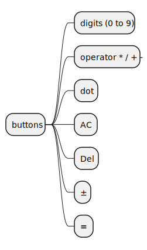

# Project Contents

## Calculator Div

## Buttons

Number of buttons: 19

> ***See some calculators images on the internet***

- Numbers from `0` to `9` and Point `.` for floating point numbers
- Operators `+`, `-`, `x`, `/`
- Equals button `=`
- Clear screen button `C`
- Delete digit button `Del`
- I may add power button $x^y$ OR Negative\\Positive $\pm$ button.

{height=250px}

## Functions

### Main functions

- `operate(firstNum, operator, secondNum)` The main function used to choose the operation based on the operator user chooses

### Operations functions

- `add(firstNum, secondNum)`
- `subtract(firstNum, secondNum)`
- `multiply(firstNum, secondNum)`
- `divide(firstNum, secondNum)`

## Font used in calculator screen

[Digital 7 font](https://www.dafont.com/digital-7.font)

## Steps

Just follow the steps mentioned in the odin project page.

# Some links from lesson page

- [Why you should never use `eval()`.](https://developer.mozilla.org/en-US/docs/Web/JavaScript/Reference/Global_Objects/eval#never_use_eval!)

- [Why you shouldn't use `new Function()` too.](https://stackoverflow.com/questions/4599857/are-eval-and-new-function-the-same-thing)
